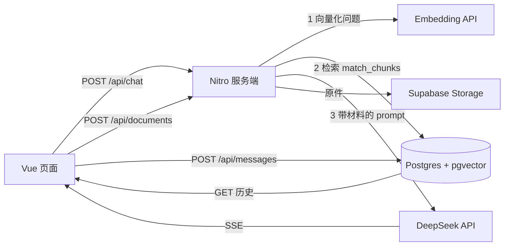

# Docs QA · 文档智能问答助手

上传文档，基于文档内容提问，得到带原文引用的回答；材料里没有的问题直接拒答。

> 技术栈：Nuxt 4 · TypeScript · Supabase (Postgres + pgvector + Storage) · DeepSeek API · BGE-M3
> 在线演示：（部署后补上）

## 功能

- **流式回答**：SSE 逐字输出，不用等整段生成完
- **多轮对话**：历史随请求带上，模型无需服务端记忆
- **会话持久化**：消息存在 Postgres，刷新页面不丢
- **文档进库**：上传 PDF / Markdown / TXT → 解析 → 清洗 → 分块 → 向量化
- **向量检索**：pgvector + HNSW 索引，按余弦相似度取回最相关的分块
- **带引用回答**：召回的块拼进 prompt，答案里用 `[1][2]` 标注依据，可点开看原文
- **拒答**：最高相似度低于阈值时直接回答「材料里没有」，不调用模型
- **检索调试**：页面上直接看「这个问题召回了哪几块、相似度多少」
- **服务端设防**：入参校验、历史截断、密钥只存在于服务端

## 架构



所有密钥只存在于服务端运行时配置，浏览器永远拿不到。

## 本地运行

```bash
pnpm install
cp .env.example .env   # 填入自己的密钥
pnpm dev
```

需要 Node 20.12 以上（仓库内 `.nvmrc` 指定了 24）。

## 环境变量

| 变量 | 说明 |
| --- | --- |
| `NUXT_DEEPSEEK_KEY` | 聊天模型密钥（默认服务商的密钥） |
| `NUXT_CHAT_KEY` | 聊天模型密钥，不填则复用 `NUXT_DEEPSEEK_KEY` |
| `NUXT_CHAT_BASE` | 聊天接口地址，默认 `https://api.deepseek.com` |
| `NUXT_CHAT_MODEL` | 聊天模型名，默认 `deepseek-chat` |
| `NUXT_EMBEDDING_KEY` | 向量化接口密钥（硅基流动） |
| `NUXT_EMBEDDING_BASE` | 向量化接口地址，默认 `https://api.siliconflow.cn/v1` |
| `NUXT_EMBEDDING_MODEL` | 向量化模型，默认 `BAAI/bge-m3`（1024 维） |
| `NUXT_SUPABASE_URL` | Supabase 项目地址 |
| `NUXT_SUPABASE_SERVICE_KEY` | Supabase secret key，仅服务端使用 |
| `NUXT_RAG_TOP_K` | 每次检索取回几块，默认 6 |
| `NUXT_RAG_THRESHOLD` | 拒答阈值，默认 0.35 |

聊天模型只要是 OpenAI 兼容接口就能换。例如 DeepSeek 余额用尽时，可以直接借道硅基流动的免费模型继续开发：

```
NUXT_CHAT_KEY=sk-硅基流动的密钥
NUXT_CHAT_BASE=https://api.siliconflow.cn/v1
NUXT_CHAT_MODEL=Qwen/Qwen2.5-7B-Instruct
```

换 embedding 模型比换聊天模型麻烦得多：向量维度和模型绑死，换了要改列定义并重算全部向量。

## 数据库

### 第一步：建表

```sql
create extension if not exists vector;

-- 会话与消息：引用信息跟消息存在一起，刷新后点 [1] 仍能展开原文
create table conversations (
  id uuid primary key default gen_random_uuid(),
  title text,
  created_at timestamptz not null default now()
);

create table messages (
  id bigint generated always as identity primary key,
  conversation_id uuid not null references conversations(id) on delete cascade,
  role text not null check (role in ('system','user','assistant')),
  content text not null,
  sources jsonb,
  created_at timestamptz not null default now()
);

create index messages_conversation_idx on messages (conversation_id, id);

create table documents (
  id uuid primary key default gen_random_uuid(),
  filename text not null,
  storage_path text not null,
  size_bytes bigint,
  char_count int,
  created_at timestamptz not null default now()
);

create table chunks (
  id bigint generated always as identity primary key,
  document_id uuid not null references documents(id) on delete cascade,
  idx int not null,
  content text not null,
  char_count int not null,
  embedding vector(1024),
  created_at timestamptz not null default now()
);

create index chunks_document_idx on chunks (document_id, idx);
create index chunks_embedding_idx on chunks using hnsw (embedding vector_cosine_ops);
```

### 第二步：鉴权与数据隔离

执行 `sql/01-auth-rls.sql`（可重复执行）。它会做四件事：

1. 给 `conversations` / `documents` 两张根表加 `user_id`
2. 给四张表打开行级安全（RLS）
3. 建策略：根表比对 `auth.uid()`，`messages` / `chunks` 沿着外键回到根表比对
4. 把检索函数声明成 `security invoker`，保证 RLS 对检索同样生效

> 老数据的 `user_id` 为空，跑完迁移后谁都看不见。要认领给某个账号，
> 去 Authentication → Users 复制 UID，执行迁移脚本末尾注释里的两条 `update`。

### 登录是怎么走的

```
浏览器 ──POST /api/auth/login──▶ 服务端 ──signInWithPassword──▶ Supabase Auth
   ▲                                │
   └──────── access/refresh token ──┘

之后每个业务请求都带 Authorization: Bearer <access_token>
服务端用它调 auth.getUser() 验签 → 拿到 user.id
数据库查询用「带用户 token 的客户端」发出 → PostgREST 按该身份执行 → RLS 生效
```

几个刻意的选择：

- **不在浏览器里放任何 Supabase 密钥**：登录由服务端代理，前端只持有我们签发的 token
- **隔离靠数据库而不是靠代码**：每条查询都要记得加 `where user_id = ?` 太容易漏，RLS 是兜底
- 服务端仍持有 service key，但只用于两件事：校验登录态、读写存储桶

检索走一个数据库函数，把「算相似度 + 排序 + 取前 K」放在数据所在的地方做：

```sql
create or replace function match_chunks(query_embedding vector(1024), match_count int default 5)
returns table (id bigint, document_id uuid, filename text, idx int, content text, similarity float)
language sql stable as $$
  select c.id, c.document_id, d.filename, c.idx, c.content,
         1 - (c.embedding <=> query_embedding) as similarity
  from chunks c
  join documents d on d.id = c.document_id
  where c.embedding is not null
  order by c.embedding <=> query_embedding
  limit match_count;
$$;
```

## 开发路线

- [x] 流式对话
- [x] 多轮上下文
- [x] 会话与消息持久化
- [x] Markdown 渲染与输出净化
- [x] 文档上传、解析、分块与文本净化
- [x] 向量化（可分批续跑）与 pgvector 检索
- [x] 带引用的回答与拒答
- [x] 引用结果随消息持久化（刷新后仍能看引用）
- [x] 评测集与评测脚本（`eval/`，覆盖答出率 / 引用率 / 拒答率 / 延迟）
- [ ] 评测面板 UI（把 `eval/` 的结果搬到页面上）
- [ ] 混合检索（关键词 + 向量）
- [ ] 重排序（Rerank）
- [ ] 部署上线

## 评测

```bash
node eval/run.mjs              # 打本地 3000
node eval/run.mjs --verbose    # 附带每题的模型回答
```

15 道题：10 道文档内（必须答出并带引用）、3 道「相关但材料没写」、2 道完全无关（后两类必须拒答）。
统计口径写在 `eval/run.mjs` 顶部：服务端拒答 = 有候选但一块都没过阈值；模型拒答 = 正文里出现「材料里没有提到」。

## 已知取舍

- **单次请求体上限 4MB**：Vercel 函数限制，大文件需要改成浏览器直传 Storage
- **扫描版 PDF 不支持**：没有文字层，需要先做 OCR
- **分块数在内存里统计**：文档量大时应改成数据库聚合查询
- **换 embedding 模型要整库重算**：向量维度与模型绑死

## 许可证

MIT
