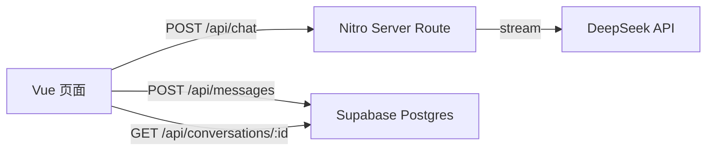

# Docs QA · 文档智能问答助手

上传文档，基于文档内容提问，得到带原文引用的回答。

> 技术栈：Nuxt 4 · TypeScript · Supabase (Postgres) · DeepSeek API
> 在线演示：（部署后补上）

## 功能

- 流式回答：SSE 逐字输出，不用等整段生成完
- 多轮对话：历史随请求带上，模型无需服务端记忆
- 会话持久化：消息存在 Postgres，刷新页面不丢
- Markdown 渲染：回答按格式渲染，输出经 DOMPurify 净化
- 服务端设防：入参校验、历史截断、密钥只存在于服务端

## 架构



所有密钥只存在于服务端运行时配置，浏览器永远拿不到。

## 本地运行

```bash
pnpm install
cp .env.example .env   # 填入自己的密钥
pnpm dev
```

需要 Node 20.12 以上（仓库内 `.nvmrc` 指定了 24）。

## 环境变量

| 变量 | 说明 |
| --- | --- |
| `NUXT_DEEPSEEK_KEY` | 模型接口密钥 |
| `NUXT_SUPABASE_URL` | Supabase 项目地址 |
| `NUXT_SUPABASE_SERVICE_KEY` | Supabase secret key，仅服务端使用 |

## 开发路线

- [x] 流式对话
- [x] 多轮上下文
- [x] 会话与消息持久化
- [x] Markdown 渲染与输出净化
- [ ] 文档上传、解析、分块
- [ ] 向量检索与引用溯源
- [ ] 混合检索（关键词 + 向量）
- [ ] 评测面板：引用命中率 / P95 延迟 / 成本
- [ ] 部署上线

## 许可证

MIT
